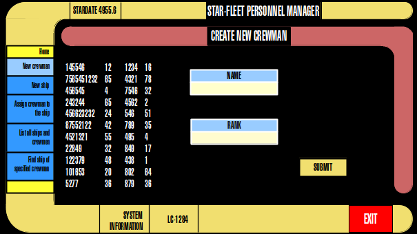

# Star fleet personnel manager

__Space, the final frontier.__ :rocket:

This application is made for educational purposes.
It's "disguised" as personnel manager of some Star fleet HR manager. 
Thus, it has
following properties (marked are implemented):

- [ ] Create crewman
- [ ] Create new unoccupied ship
- [ ] Assign crewman to the ship
- [ ] List all ships and crewmen
- [ ] Find the ship of specified crewman

_Note: The table above also describes user case diagram._

### Class diagram

_Soon..._

### GUI sample
Yes, it really is LCARS. :v:

[]

### Team composition:
- Michal Polovka (@xpolovka)
- Katarina Bulkova (@xbulkova)

*Disclaimer:*

_This project is not in any way related to Gene Roddenberry or is product of Star Trek official franchise.__
